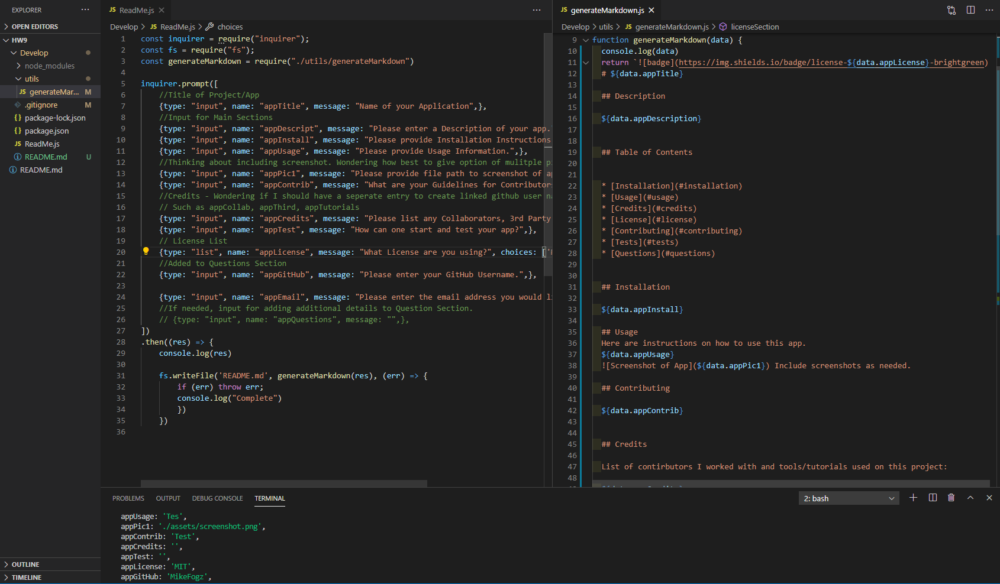

# ReadMe Generator

## Description

This is a node based application that makes use of NPM Inquirer running on JavaScript. The purpose of this app is to help the user create a high quality README markdown file quickly and easily. By taking text and list inputs and adding them to a markdown template.

## Table of Contents

- [Installation](#installation)
- [Usage](#usage)
- [Credits](#credits)
- [License](#license)
- [Contributing](#contributing)
- [Tests](#tests)
- [Questions](#questions)

## Installation

Clone the Repo, install inquirer (npm install inquirer), & insure package.json is present (npm init). Once the node modules & package.json are created you can move on to usage.

## Usage

Once installed run the applicaiton by opening the terminal and entering: node ReadMe.js

Follow the prompts to generate your README.md.

Screen Shot of the code

[Link to Video walk thru](https://drive.google.com/file/d/15NA7BKujWlohl1tq1xhtjAiZJgzGKwVN/view)

## Contributing

This project is open to collaboration.

## Credits

List of contirbutors I worked with and tools/tutorials used on this project:

## License

MIT

MIT License

Copyright (c) [2020] [Mike Fogarty]

Permission is hereby granted, free of charge, to any person obtaining a copy
of this software and associated documentation files (the "Software"), to deal
in the Software without restriction, including without limitation the rights
to use, copy, modify, merge, publish, distribute, sublicense, and/or sell
copies of the Software, and to permit persons to whom the Software is
furnished to do so, subject to the following conditions:

The above copyright notice and this permission notice shall be included in all
copies or substantial portions of the Software.

THE SOFTWARE IS PROVIDED "AS IS", WITHOUT WARRANTY OF ANY KIND, EXPRESS OR
IMPLIED, INCLUDING BUT NOT LIMITED TO THE WARRANTIES OF MERCHANTABILITY,
FITNESS FOR A PARTICULAR PURPOSE AND NONINFRINGEMENT. IN NO EVENT SHALL THE
AUTHORS OR COPYRIGHT HOLDERS BE LIABLE FOR ANY CLAIM, DAMAGES OR OTHER
LIABILITY, WHETHER IN AN ACTION OF CONTRACT, TORT OR OTHERWISE, ARISING FROM,
OUT OF OR IN CONNECTION WITH THE SOFTWARE OR THE USE OR OTHER DEALINGS IN THE
SOFTWARE.

## Tests

N/A

## Questions

You can find me on GitHub [@MikeFogz](https://github.com/MikeFogz)

I can be contacted at MikeFogz@gmail.com
